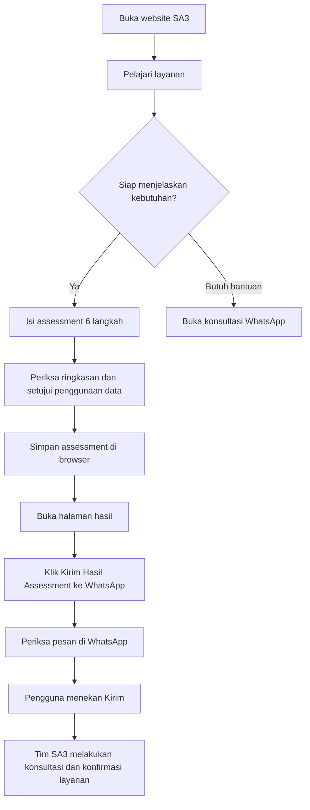
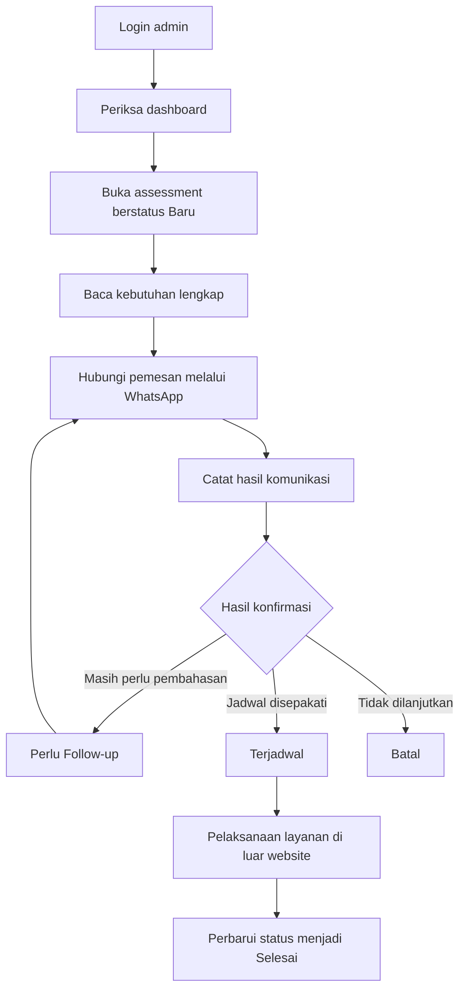

# Panduan Website & Alur Layanan SA3 Home Care

**Nama website:** SA3 Home Care  
**Alamat website yang ditetapkan:** https://sa3-homecare.dekatlokal  
**Motto:** Kami Ada Sepenuh Hati Untuk Anda  
**Versi dokumen:** 1.0 — 25 September 2026  
**Ditujukan untuk:** pemilik bisnis, tim layanan pelanggan, admin, dan pihak yang melakukan presentasi website.

> Dokumen ini menjelaskan website yang telah dibuat beserta cara penggunaannya. Versi saat ini merupakan prototype dengan penyimpanan di browser. Penulisan alamat website di atas tidak berarti domain, hosting, dan akses publiknya sudah diaktifkan. Aktivasi alamat tersebut menjadi bagian dari proses publikasi website.

---

## 1. Gambaran website

Website SA3 Home Care menjadi pintu masuk bagi keluarga untuk mengenal layanan perawatan di rumah, memahami pilihan pendampingan, menyampaikan kebutuhan pasien, dan memulai konsultasi bersama tim SA3.

Website terdiri dari dua bagian:

| Bagian | Pengguna | Fungsi utama |
| --- | --- | --- |
| Website publik | Calon pasien, keluarga, dan pengunjung | Mengenal SA3, melihat layanan, membaca informasi, mengisi assessment, dan menghubungi tim |
| Portal admin | Tim pengelola SA3 | Meninjau assessment yang tersimpan, mencatat tindak lanjut, memperbarui status, dan mengelola pengaturan demo |

Pengunjung tidak perlu membuat akun untuk membaca informasi atau mengisi assessment. Portal admin memiliki halaman login terpisah.

### Tujuan bisnis

1. Memperjelas identitas SA3 Home Care dan cara menghubunginya.
2. Memudahkan keluarga menemukan layanan sesuai kebutuhan.
3. Mengumpulkan informasi awal secara terstruktur agar konsultasi lebih terarah.
4. Mengurangi kebutuhan mengetik ulang ringkasan ketika melanjutkan percakapan melalui WhatsApp.
5. Mendemonstrasikan cara admin memantau assessment dan mencatat perkembangan tindak lanjut.

Website tidak menentukan diagnosis, memberikan keputusan medis otomatis, atau mengonfirmasi ketersediaan tenaga secara otomatis.

## 2. Identitas dan tampilan

Identitas SA3 dipertahankan melalui logo, nama, motto, layanan, dan nilai **Silih Asih, Silih Asah, Silih Asuh**.

Tampilan menggunakan ungu sebagai warna utama, pink sebagai aksen, serta putih dan lavender muda untuk latar. Foto perawatan membantu menggambarkan suasana pelayanan yang hangat. Warna ini diterapkan pada halaman publik, form, login, dan dashboard.

Tombol WhatsApp menggunakan aset logo WhatsApp dari paket resmi Meta. Logo tampil dalam varian hijau atau putih sesuai latarnya; bentuknya tidak diganti dengan simbol percakapan umum.

Prinsip tampilan:

- Tombol utama mudah ditemukan.
- Informasi disusun dalam bagian yang ringkas.
- Form dibagi menjadi beberapa langkah agar nyaman diisi.
- Website menyesuaikan ukuran komputer, tablet, dan ponsel.
- Animasi digunakan pada bagian tertentu dan mengikuti preferensi pengurangan gerakan pada perangkat.

## 3. Daftar halaman dan alamat

Alamat halaman tidak menampilkan akhiran `.html`. Semua alamat berikut menggunakan awalan **https://sa3-homecare.dekatlokal** setelah website dipublikasikan.

| Halaman | Alamat | Isi utama |
| --- | --- | --- |
| Beranda | `/` | Pengenalan SA3, layanan pilihan, manfaat, alur, testimoni, area, dan artikel |
| Tentang Kami | `/tentang` | Cerita, nilai, visi, dan misi SA3 |
| Layanan | `/layanan` | Daftar layanan dan pencarian layanan |
| Artikel | `/blog` | Daftar artikel informasi layanan |
| Baca artikel | `/blog?artikel=persiapan` | Contoh halaman artikel lengkap |
| Kontak | `/kontak` | WhatsApp, nomor telepon, email, dan lokasi |
| Assessment | `/assessment` | Form kebutuhan pasien dalam enam langkah |
| Hasil assessment | `/assessment-success?id=ID-ASSESSMENT` | Ringkasan, salin ID, salin pesan, dan WhatsApp |
| Login admin | `/admin/login` | Pintu masuk portal admin |
| Dashboard | `/admin/dashboard` | Ringkasan angka, assessment terbaru, dan distribusi |
| Daftar assessment | `/admin/patients` | Pencarian dan penyaringan data |
| Detail assessment | `/admin/patient-detail?id=ID-ASSESSMENT` | Informasi lengkap dan tindakan admin |
| Pengaturan | `/admin/settings` | Nomor WhatsApp dan pengelolaan data lokal |

Bagian `?id=...` digunakan untuk memilih assessment yang benar. Bagian `?artikel=...` digunakan untuk memilih artikel. Keduanya tetap dibutuhkan meskipun alamat tidak memakai `.html`.

Tautan lama dengan `.html` diarahkan ke alamat bersih oleh server yang telah dikonfigurasi. Tautan ke bagian layanan, misalnya `/layanan#lansia`, membuka bagian layanan terkait.

## 4. Navigasi website

### Pada komputer

Header menampilkan logo SA3, menu Beranda, Tentang Kami, Layanan, Artikel, Kontak, dan akses konsultasi WhatsApp. Header tetap mudah diakses ketika pengunjung menggulir halaman.

Logo SA3 dapat diklik untuk kembali ke Beranda. Bagian bawah halaman menyediakan tautan layanan, kontak, dan Portal Admin.

### Pada ponsel

1. Tekan tombol hamburger di kanan header.
2. Panel navigasi bergerak masuk dari kanan menuju kiri.
3. Latar halaman menjadi redup agar perhatian terarah ke menu.
4. Pilih halaman yang ingin dibuka.
5. Halaman aktif diberi penanda warna.

Panel juga menyediakan tombol **Isi Assessment Kebutuhan** dan **Konsultasi via WhatsApp**. Menu dapat ditutup dengan tombol silang, menekan area di luar panel, atau tombol Escape pada keyboard.

Selama menu publik terbuka, fokus keyboard berada di dalam panel dan halaman di belakang tidak dapat dioperasikan. Pada layar pendek, panel dapat digulir untuk mencapai seluruh isi menu.

Menu admin di ponsel juga bergerak dari kanan. Pengguna dapat menutupnya menggunakan tombol silang, area latar, atau Escape.

## 5. Alur utama pengunjung



**Contoh:** seorang anak mencari pendamping untuk orang tuanya. Ia membaca layanan pendampingan lansia, memilih konsultasi kebutuhan, mengisi assessment, lalu meneruskan ringkasan melalui WhatsApp. Tim SA3 membahas kebutuhan, jadwal, ketersediaan tenaga, dan biaya sebelum layanan disepakati.

Pengunjung yang belum siap mengisi form dapat langsung memilih WhatsApp. Pengisian assessment bukan syarat untuk sekadar bertanya mengenai layanan.

## 6. Beranda

Beranda memberi gambaran umum tanpa mengharuskan pengunjung membuka semua halaman terlebih dahulu.

Urutan informasi:

1. **Pengenalan utama:** pesan tentang perawatan profesional dan kehangatan pendampingan.
2. **Tombol tindakan:** Isi Assessment Kebutuhan dan Lihat Layanan.
3. **Informasi kepercayaan:** pengalaman sejak 2016, respons, tenaga profesional, dan jangkauan.
4. **Mengapa SA3:** pendampingan personal, fleksibilitas jadwal, dan kejelasan kebutuhan layanan.
5. **Layanan pilihan:** akses cepat ke kebutuhan yang sering dicari.
6. **Cara memperoleh layanan:** assessment, konsultasi, penentuan layanan, dan pendampingan.
7. **Ajakan mengisi assessment.**
8. **Tentang SA3:** pengenalan nilai dan pendekatan pelayanan.
9. **Testimoni:** ringkasan pengalaman yang bersumber dari website SA3 sebelumnya.
10. **Area pelayanan:** pengenalan wilayah dan ajakan memeriksa ketersediaan.
11. **Artikel:** informasi untuk mengenal layanan dan mempersiapkan pendampingan.
12. **Kontak dan footer.**

Informasi area tidak berarti seluruh jenis layanan atau tenaga selalu tersedia di setiap kota. Ketersediaan perlu dikonfirmasi kepada tim.

## 7. Tentang Kami

Halaman ini menjelaskan latar belakang SA3 Home Care, nilai pelayanan, visi, dan misi.

- **Silih Asih:** perhatian dan kasih dalam pendampingan.
- **Silih Asah:** berbagi pengetahuan dan membantu keluarga memahami kebutuhan perawatan.
- **Silih Asuh:** saling menjaga dan mendukung keberlanjutan pendampingan.

Halaman ini membantu keluarga mengenal pendekatan SA3 sebelum memulai konsultasi.

## 8. Halaman layanan

Tersedia 13 kategori layanan:

| No. | Layanan |
| --- | --- |
| 1 | Perawatan Pre/Post Hospital |
| 2 | Pendampingan Lansia / Caregiver |
| 3 | Perawatan Pasien Stroke |
| 4 | Visit Dokter dan Perawat |
| 5 | Konsultasi Dokter Medis |
| 6 | Bidan, Bayi, dan Ibu Hamil |
| 7 | Pemeriksaan Lab |
| 8 | Perawatan Luka |
| 9 | Fisioterapi / Terapi ROM |
| 10 | Pemasangan Infus, Kateter, NGT |
| 11 | Hipnoterapi |
| 12 | Penyewaan dan Pembelian Alat Kesehatan |
| 13 | Konsultasi kebutuhan lainnya |

### Cara menggunakan

1. Buka menu **Layanan**.
2. Baca kartu layanan atau ketik kata kunci pada kolom pencarian.
3. Tekan **Konsultasikan kebutuhan** pada layanan yang dipilih.
4. Form assessment terbuka dengan layanan utama terpilih apabila belum ada pilihan layanan dalam draft.
5. Pengunjung masih dapat mengganti pilihan saat mengisi form.

Jika pencarian tidak menemukan hasil, halaman memberi informasi bahwa layanan tidak ditemukan. Pengunjung dapat mencoba kata kunci lain atau menghubungi tim.

Website belum menampilkan pemesanan otomatis, daftar harga terperinci, atau kalender ketersediaan tenaga. Rincian dibahas ketika konsultasi.

## 9. Assessment kebutuhan: panduan enam langkah

Assessment membantu keluarga menyampaikan informasi awal secara terstruktur. Estimasi pengisian pada tampilan sekitar **5–8 menit**, tergantung kelengkapan informasi.

Kolom dengan tanda bintang wajib diisi. Kolom opsional dapat dikosongkan jika informasinya belum diketahui. Tidak ada permintaan NIK atau unggahan dokumen medis pada versi ini.

### Langkah 1 — Data pemesan

| Informasi | Keterangan |
| --- | --- |
| Nama pemesan | Wajib, minimal dua karakter |
| Nomor WhatsApp | Wajib; nomor Indonesia, misalnya diawali `08` atau `+62` |
| Hubungan dengan pasien | Wajib; diri sendiri, anak, pasangan, saudara, caregiver, atau lainnya |
| Email | Opsional; jika diisi harus menggunakan format email yang valid |

Pemesan adalah orang yang dapat dihubungi tim. Pemesan tidak harus sama dengan pasien.

### Langkah 2 — Informasi pasien

Informasi wajib: nama pasien, kelompok usia, kota/kabupaten, dan kecamatan/area.

Kelompok usia mencakup anak, remaja, dewasa, 60–69 tahun, 70–79 tahun, dan 80 tahun ke atas. Jenis kelamin dan alamat lengkap merupakan informasi opsional.

### Langkah 3 — Kebutuhan layanan

- Pilih satu layanan utama; wajib.
- Pilih layanan tambahan jika diperlukan; opsional.
- Pilih durasi; wajib.
- Tentukan tanggal mulai dan preferensi jam jika sudah diketahui; opsional.

Pilihan durasi: visit satu kali, 4 jam, 8 jam, 12 jam, 24 jam, harian, mingguan, bulanan, atau belum tahu/perlu rekomendasi.

Tanggal mulai yang diisi tidak boleh berada di masa lalu. Tanggal dan durasi ini merupakan permintaan awal, bukan jadwal yang sudah dikonfirmasi.

### Langkah 4 — Kondisi dan kebutuhan awal

Pengunjung dapat menjelaskan informasi dengan bahasa sehari-hari:

- Kondisi atau diagnosis yang telah diketahui keluarga.
- Tingkat kemandirian.
- Mobilitas: berjalan mandiri, tongkat, walker, kursi roda, bedrest, atau belum tahu.
- Kebutuhan bantuan mandi, berpakaian, makan/minum, toileting, berpindah, berjalan, pengingat obat, dan monitoring sesuai arahan tenaga kesehatan.
- Alat atau kondisi terkait, seperti oksigen, kateter, NGT, infus, trakeostomi, luka, suction, dan tempat tidur pasien.
- Riwayat jatuh dalam tiga bulan terakhir.
- Kesulitan komunikasi.
- Catatan penting keluarga.

Bagian ini bersifat opsional dan tidak menghasilkan diagnosis atau keputusan medis otomatis. Informasi yang dimasukkan membantu percakapan lanjutan.

### Langkah 5 — Lingkungan dan preferensi

Pengunjung dapat mengisi tempat layanan, akses tangga/lift, kehadiran keluarga di lokasi, preferensi tenaga, bahasa komunikasi, serta kebutuhan khusus.

Preferensi merupakan bahan diskusi. Pemenuhannya mengikuti hasil konfirmasi dan ketersediaan tenaga.

### Langkah 6 — Periksa dan konfirmasi

Semua informasi ditampilkan kembali agar pemesan dapat memeriksa nama, lokasi, layanan, jadwal, kondisi, dan preferensi.

Dua persetujuan wajib:

1. Memahami bahwa assessment merupakan informasi awal dan bukan diagnosis atau pengganti pemeriksaan tenaga kesehatan.
2. Menyetujui penggunaan data untuk konsultasi dan tindak lanjut layanan.

Jika ada isian yang perlu diubah, gunakan **Kembali**. Setelah sesuai, tekan **Simpan Assessment**.

### Bantuan ketika mengisi

- Tombol **Lanjutkan** memeriksa kolom wajib sebelum berpindah langkah.
- Kesalahan ditandai pada kolom dan disertai pesan.
- Isian tetap tersedia ketika maju atau mundur.
- Draft disimpan selama sesi tab agar refresh tidak menghapus seluruh isian.
- Draft bukan penyimpanan permanen; menutup sesi atau membersihkan data browser dapat menghilangkannya.
- Setelah penyimpanan berhasil, draft dihapus dan halaman hasil dibuka.
- Jika penyimpanan gagal, pengunjung mendapat pesan dan dapat mencoba kembali.

> Jika kondisi pasien darurat atau memburuk cepat, jangan menunggu respons form. Segera hubungi layanan darurat atau fasilitas kesehatan terdekat.

## 10. Halaman hasil assessment

Setiap assessment mendapat nomor unik dengan bentuk **SA3-YYYYMMDD-XXXX**. Contoh ilustrasi: `SA3-20260925-ABCD`.

Halaman hasil menyediakan:

| Fitur | Kegunaan |
| --- | --- |
| ID assessment | Referensi saat berdiskusi dengan tim |
| Salin ID | Menyalin nomor assessment |
| Ringkasan lengkap | Memeriksa informasi yang sudah disimpan |
| Copy Ringkasan | Menyalin pesan yang disiapkan untuk konsultasi |
| Kirim Hasil Assessment ke WhatsApp | Membuka WhatsApp dengan pesan siap dikirim |
| Lihat teks ringkasan | Melihat isi pesan sebelum membuka WhatsApp |
| Kembali ke Beranda | Mengakhiri proses pengisian |

Ringkasan dibaca dari data yang tersimpan, sehingga tetap dapat ditampilkan setelah refresh pada browser dan alamat website yang sama.

Pada prototype, tautan hasil yang dibuka di perangkat lain tidak otomatis menemukan datanya. Jika assessment tidak tersedia atau sudah dihapus, halaman menampilkan informasi bahwa assessment tidak ditemukan.

## 11. Cara kerja WhatsApp

### Konsultasi umum

Tombol konsultasi membuka WhatsApp menuju nomor tujuan yang diatur. Pesan awal mengajak tim SA3 membahas kebutuhan layanan.

### Pengiriman ringkasan

Tombol pada hasil assessment menyiapkan pesan berisi:

- ID assessment.
- Nama pemesan dan pasien.
- Kota dan kecamatan.
- Layanan utama dan durasi.
- Tanggal mulai dan preferensi waktu.
- Mobilitas.
- Kebutuhan bantuan utama.
- Alat atau kondisi yang relevan.
- Catatan keluarga.

Informasi seperti email dan alamat lengkap tidak dimasukkan ke pesan ringkas ini. Pengguna tetap perlu memeriksa isi pesan sebelum mengirim.

**Membuka WhatsApp tidak sama dengan mengirim pesan.** Pengguna harus menekan tombol Kirim di aplikasi atau WhatsApp Web. Website tidak dapat memastikan apakah pesan benar-benar telah dikirim, dibaca, atau dibalas.

### Nomor tujuan

Nomor default konsultasi: **0823 1919 9534** (`6282319199534`). Admin dapat mengubah tujuan tombol konsultasi dan ringkasan melalui Pengaturan.

Perubahan pengaturan tersebut berlaku pada browser yang sama. Nomor telepon yang tercantum sebagai informasi bisnis di header/footer/kontak masih merupakan konten website dan perlu diperbarui terpisah jika nomor bisnis berubah secara permanen.

### Batas integrasi saat ini

Tidak ada bot WhatsApp, balasan otomatis, notifikasi pesan masuk, sinkronisasi percakapan, atau WhatsApp Business API. Percakapan berlangsung di WhatsApp secara manual.

## 12. Artikel dan kontak

### Artikel

Halaman Artikel berisi informasi layanan untuk membantu keluarga memahami persiapan dan proses pendampingan. Pengunjung dapat membuka masing-masing artikel melalui tombol **Baca artikel**.

Konten awal mencakup persiapan rumah, pemilihan pendamping, dan alur assessment. Artikel merupakan informasi layanan, bukan panduan diagnosis atau pengobatan. Belum tersedia editor artikel di portal admin.

### Kontak

Informasi yang ditampilkan:

- **Alamat:** Jl. Lodaya No.65, Malabar, Kota Bandung, Jawa Barat.
- **Telepon utama:** 0823 1919 9534.
- **Telepon tambahan:** 0895 3254 04906.
- **Email:** homecaresa3@gmail.com.
- Tautan WhatsApp untuk konsultasi.
- Tautan peta untuk melihat lokasi.

Tautan peta membuka layanan peta eksternal. Email membuka aplikasi email sesuai pengaturan perangkat.

## 13. Masuk ke portal admin

1. Buka `/admin/login`, atau pilih **Portal Admin** pada footer.
2. Isi username dan password.
3. Tekan **Masuk ke Dashboard**.
4. Jika data tidak sesuai, halaman menampilkan pesan kesalahan.

Halaman dashboard, daftar, detail, dan pengaturan mengarahkan pengguna ke login jika sesi admin tidak tersedia.

Sesi demo menggunakan penyimpanan sesi browser. Login ulang mungkin diperlukan ketika menggunakan tab/sesi lain. Gunakan **Keluar** setelah selesai.

> Login versi ini hanya gerbang demonstrasi. Penyimpanan di browser dan kredensial demo tidak memberikan perlindungan autentikasi untuk operasional pasien sungguhan.

## 14. Dashboard admin

Dashboard membantu tim melihat gambaran assessment yang tersedia pada browser ini.

| Kartu ringkasan | Makna |
| --- | --- |
| Assessment Hari Ini | Jumlah assessment yang dibuat pada tanggal lokal hari ini |
| Assessment Baru | Jumlah dengan status Baru |
| Perlu Follow-up | Jumlah dengan status Perlu Follow-up |
| Terjadwal | Jumlah dengan status Terjadwal |

Bagian lainnya:

- **Assessment terbaru:** maksimal enam record terbaru, dengan akses ke detail.
- **Distribusi status:** jumlah assessment berdasarkan status.
- **Layanan paling diminati:** perbandingan layanan utama yang tercatat.
- **Akses cepat:** daftar assessment baru, form assessment, dan pengaturan.

Angka dan grafik dihitung dari data tersimpan. Record demo juga dihitung selama belum dihapus. Angka tersebut bukan statistik operasional nasional SA3 atau data dari semua perangkat.

## 15. Mencari dan menyaring assessment

Buka **Assessment / Pasien** pada menu admin.

Pencarian mendukung nama pasien, nama pemesan, nomor WhatsApp, ID, kota, dan area. Filter yang tersedia:

- Status.
- Layanan utama.
- Kota/area.
- Rentang tanggal masuk.
- Urutan terbaru atau terlama.

Beberapa filter dapat dipakai bersamaan. Rentang tanggal menggunakan tanggal masuk assessment, bukan tanggal kunjungan yang diminta.

Tekan **Reset filter** untuk menampilkan data kembali tanpa penyaringan. Jika hasil kosong, coba mengurangi filter atau periksa kata kunci.

Pada komputer, data tampil sebagai tabel. Pada ponsel, data berubah menjadi kartu agar informasi tetap dapat dibaca tanpa menggeser tabel lebar.

## 16. Detail assessment dan tindak lanjut

Klik nama pasien atau tombol detail untuk melihat:

1. Identitas dan ID assessment.
2. Informasi pemesan.
3. Informasi pasien dan alamat.
4. Layanan, durasi, serta jadwal yang diminta.
5. Kondisi dan kebutuhan aktivitas sehari-hari.
6. Alat atau kondisi terkait.
7. Lingkungan, preferensi, dan catatan keluarga.
8. Persetujuan yang diberikan.
9. Status dan catatan admin.
10. Riwayat aktivitas.

### Mengubah status

Pilih status pada bagian Tindak lanjut, lalu tekan **Simpan Status**. Perubahan dicatat pada riwayat aktivitas dan tetap tersimpan setelah refresh.

| Status | Panduan penggunaan oleh tim |
| --- | --- |
| Baru | Assessment baru disimpan; belum ditindaklanjuti |
| Dihubungi | Tim telah memulai komunikasi dengan pemesan |
| Perlu Follow-up | Masih ada hal yang perlu dikonfirmasi atau dibahas kembali |
| Terjadwal | Tim telah menyepakati jadwal layanan dengan keluarga |
| Selesai | Proses yang ditangani tim telah selesai sesuai pencatatan internal |
| Batal | Kebutuhan tidak dilanjutkan atau dibatalkan |

Alur kerja yang disarankan: **Baru → Dihubungi → Perlu Follow-up / Terjadwal → Selesai**. Status Batal digunakan bila proses tidak dilanjutkan.

Website tidak memaksakan urutan status. Admin bertanggung jawab memilih status berdasarkan keadaan sebenarnya. Mengubah status ke Terjadwal tidak membuat reservasi tenaga, mengirim pesan, atau menambah jadwal pada kalender eksternal.

### Catatan admin

Tuliskan informasi tindak lanjut yang relevan, kemudian tekan **Simpan Catatan**. Mengetik saja belum menyimpan catatan. Penyimpanan berikutnya memperbarui isi catatan utama; riwayat mencatat bahwa catatan diubah, bukan seluruh versi isi catatan lama.

### Menghubungi pemesan

**WhatsApp Pemesan** membuka pesan awal ke nomor yang diberikan pemesan. Admin tetap perlu memeriksa dan mengirim pesannya di WhatsApp. Tombol ini tidak diaktifkan pada record fiktif bawaan agar nomor demo tidak dihubungi.

### Menyalin dan menghapus

- **Copy Ringkasan** menyalin ringkasan assessment.
- **Hapus Assessment** membuka konfirmasi. Pilih Batal untuk mempertahankan data.
- Jika dikonfirmasi, assessment dan riwayat aktivitasnya dihapus dari browser ini.
- Tidak tersedia tempat sampah atau pemulihan otomatis.

## 17. Pengaturan admin

### Informasi mode

Pengaturan menampilkan **Mode: Local Prototype**, alamat asal penyimpanan, jumlah assessment, dan jumlah record demo.

### Nomor WhatsApp konsultasi

Masukkan nomor yang valid lalu tekan **Simpan Pengaturan**. Nomor dipakai oleh tombol konsultasi publik dan pengiriman hasil assessment pada browser tersebut.

### Reset Demo Data

Tombol ini mengganti record demo dengan delapan assessment fiktif. Perubahan status, catatan, dan aktivitas pada record demo yang lama ikut diganti.

Assessment yang diisi sendiri melalui form tetap dipertahankan. Konfirmasi diminta sebelum reset berjalan.

### Clear All Data

Menghapus seluruh assessment, catatan, riwayat aktivitas, serta pengaturan lokal. Pengguna harus membuka konfirmasi dan mengetik **HAPUS** sebelum melanjutkan.

Setelah penghapusan:

- Nomor WhatsApp kembali ke default.
- Draft assessment pada tab admin yang sedang digunakan dibersihkan.
- Data demo tidak langsung muncul lagi saat dashboard dibuka.
- Untuk menampilkan data contoh kembali, gunakan Reset Demo Data.
- Draft pada tab lain dapat tetap ada karena penyimpanan sesi terpisah; tutup tab demo lain jika ingin membersihkan seluruh sesi demonstrasi.

## 18. Alur kerja admin yang disarankan



Rutinitas yang dapat digunakan ketika presentasi:

1. Tinjau assessment baru.
2. Periksa layanan, area, dan permintaan jadwal.
3. Hubungi pemesan untuk melengkapi informasi.
4. Simpan catatan hasil komunikasi.
5. Sesuaikan status.
6. Gunakan filter Perlu Follow-up untuk meninjau pekerjaan yang belum selesai.

Versi saat ini tidak mengirim pengingat follow-up otomatis. Pemantauan dilakukan oleh admin melalui dashboard dan daftar assessment.

## 19. Penjelasan penyimpanan versi saat ini

Assessment disimpan di **IndexedDB**, yaitu penyimpanan lokal di browser. Draft dan sesi login menggunakan penyimpanan sesi tab.

Implikasinya:

| Kondisi | Perilaku prototype |
| --- | --- |
| Halaman di-refresh pada browser dan alamat yang sama | Assessment final tetap tersedia |
| User dan admin berada pada browser serta origin yang sama | Admin dapat membaca assessment yang disimpan melalui form |
| Pasien menggunakan HP, admin menggunakan laptop lain | Data tidak otomatis berpindah ke dashboard admin |
| Menggunakan browser lain | Penyimpanan berbeda |
| Alamat, protokol, atau port berubah | Penyimpanan dianggap berbeda |
| Data browser dibersihkan | Assessment dapat terhapus |
| Membagikan tautan hasil ke perangkat lain | Isi assessment tidak ikut dipindahkan |

Origin berarti kombinasi protokol, nama host, dan port. Contohnya, data pada `http://localhost:5500` tidak otomatis muncul pada `https://sa3-homecare.dekatlokal`.

Mempublikasikan file website saja belum membuat dashboard tersinkron antarperangkat. Dalam prototype, WhatsApp menjadi sarana untuk meneruskan ringkasan secara manual; pesan yang masuk tidak otomatis menjadi record baru di dashboard perangkat lain.

## 20. Privasi dan batas fungsi

Persetujuan penggunaan data ditampilkan sebelum assessment disimpan. Form tidak meminta NIK dan tidak menyediakan unggahan dokumen kesehatan.

Untuk demonstrasi, gunakan data fiktif. Versi ini belum memiliki:

- Database online bersama.
- Autentikasi dan pengaturan hak akses untuk operasional.
- Enkripsi aplikasi yang dapat diklaim sebagai perlindungan data pasien.
- Backup dan pemulihan data terpusat.
- Rekam medis elektronik.
- Diagnosis atau triage otomatis.
- Pembayaran online.
- Ketersediaan tenaga secara langsung.
- Pemesanan dan penjadwalan otomatis.
- Notifikasi atau pengingat berbasis server.
- Sinkronisasi pesan WhatsApp.
- Editor layanan/artikel atau pengelolaan banyak akun admin.

Daftar ini memperjelas ruang lingkup prototype dan membantu menentukan kebutuhan tahap berikutnya.

## 21. Skenario presentasi kepada klien

**Durasi yang disarankan: 10–15 menit.**

1. **Pengenalan:** tampilkan Beranda dan jelaskan pendekatan visual ungu–pink serta identitas SA3.
2. **Pengalaman mobile:** buka menu hamburger, tunjukkan panel dari kanan, dan akses layanan.
3. **Pencarian layanan:** cari pendampingan lansia dan pilih konsultasi kebutuhan.
4. **Assessment:** isi data fiktif, tunjukkan perpindahan langkah dan review.
5. **Penyimpanan:** simpan assessment, tunjukkan ID dan ringkasannya.
6. **WhatsApp:** buka pesan siap kirim. Untuk demo, cukup periksa pesan tanpa mengirimnya ke nomor bisnis.
7. **Admin:** buka dashboard pada browser dan origin yang sama.
8. **Tindak lanjut:** cari pasien demo yang baru dibuat, ubah status, dan simpan catatan.
9. **Persistensi:** refresh untuk menunjukkan data tidak hilang.
10. **Batasan dan pengembangan:** jelaskan bahwa sinkronisasi lintas perangkat membutuhkan tahap backend.

Contoh data presentasi: pemesan “Keluarga Demo”, pasien “Pasien Contoh”, area “Bandung — Lengkong”, layanan “Pendampingan Lansia / Caregiver”. Gunakan nomor uji yang disepakati; jangan mengirim pesan ke nomor orang lain.

## 22. Pertanyaan yang sering muncul

### Apakah mengisi assessment berarti layanan langsung dipesan?

Belum. Assessment merupakan informasi awal. Tim perlu mengonfirmasi kebutuhan, tenaga, jadwal, dan biaya bersama keluarga.

### Apakah assessment langsung diterima admin di perangkat lain?

Belum pada prototype ini. Data hanya dapat dibaca dashboard dari browser dan origin yang sama. Ringkasan dapat diteruskan melalui WhatsApp secara manual.

### Apakah tombol WhatsApp langsung mengirim pesan?

Tidak. Tombol membuka WhatsApp dengan teks yang sudah disiapkan. Pengguna masih harus menekan Kirim.

### Apakah keluarga harus memahami istilah medis?

Tidak. Form menggunakan bahasa sehari-hari dan menyediakan kolom catatan. Keluarga dapat mengosongkan informasi opsional yang belum diketahui.

### Apa yang dilakukan jika form tidak bisa dilanjutkan?

Periksa kolom bertanda bintang, format nomor WhatsApp, email jika diisi, dan tanggal mulai. Pada langkah terakhir, pastikan dua persetujuan sudah dicentang.

### Mengapa ringkasan tidak ditemukan?

Pastikan menggunakan browser dan alamat website yang sama seperti saat mengisi form. Data mungkin juga sudah dihapus melalui admin atau pengaturan browser.

### Mengapa perubahan catatan belum muncul setelah refresh?

Pastikan tombol Simpan Catatan telah ditekan dan pesan berhasil muncul. Mengetik tidak otomatis menyimpan catatan admin.

### Bagaimana jika tombol salin tidak bekerja?

Browser dapat membatasi akses clipboard. Buka teks ringkasan, pilih teks, lalu salin secara manual. Gunakan localhost atau HTTPS ketika menjalankan website.

### Apakah seluruh kota yang ditampilkan pasti tersedia?

Jangkauan yang ditampilkan merupakan informasi umum. Jenis layanan, tenaga, dan waktu layanan perlu dikonfirmasi ke tim SA3.

### Mengapa ada pasien berlabel “Demo”?

Record tersebut merupakan data contoh fiktif untuk presentasi. Record ini tidak mewakili pasien sungguhan dan dapat di-reset atau dihapus melalui Pengaturan.

### Mengapa alamat bersih tidak terbuka pada server tertentu?

Server perlu menerjemahkan alamat seperti `/layanan` ke file halaman yang sesuai. Gunakan server lokal yang disertakan atau konfigurasi hosting yang mendukung aturan URL bersih.

## 23. Persiapan sebelum publikasi

Hal berikut perlu diselesaikan bersama pengelola website:

1. Konfirmasi penulisan alamat `https://sa3-homecare.dekatlokal` persis seperti yang diinginkan.
2. Siapkan dan verifikasi DNS, hosting, serta sertifikat HTTPS untuk alamat tersebut.
3. Terapkan aturan URL bersih pada server hosting.
4. Periksa seluruh kontak, foto, nama layanan, area, dan materi testimoni.
5. Sepakati apakah publikasi hanya untuk demo atau dilanjutkan menjadi sistem operasional.
6. Jika akan dipakai untuk pasien sungguhan, selesaikan backend, autentikasi, akses data, backup, dan pengelolaan privasi terlebih dahulu.
7. Uji ulang link, form, WhatsApp, login, dan halaman admin pada hosting tujuan.

File `.htaccess` disertakan untuk Apache/LiteSpeed. Hosting dengan jenis server lain memerlukan aturan setara. Perubahan URL tidak menggantikan proses pengaturan domain atau publikasi.

## 24. Arah pengembangan berikutnya

Prioritas pengembangan menuju penggunaan lintas perangkat:

| Prioritas | Pengembangan | Manfaat |
| --- | --- | --- |
| 1 | Backend dan database bersama | Assessment dari perangkat keluarga dapat masuk ke dashboard admin |
| 2 | Login aman dan hak akses | Membatasi akses sesuai tanggung jawab tim |
| 3 | Kebijakan penyimpanan, audit, dan backup | Mendukung pengelolaan serta pemulihan data |
| 4 | Notifikasi assessment dan pengingat tindak lanjut | Membantu tim mengetahui pekerjaan yang perlu ditangani |
| 5 | Penjadwalan serta pengelolaan tenaga | Menghubungkan kebutuhan keluarga dengan kapasitas layanan |
| 6 | Pengelolaan artikel dan layanan | Memungkinkan perubahan konten melalui portal |

Fitur-fitur tersebut merupakan rencana pengembangan, bukan bagian yang sudah aktif pada versi ini.

## Lampiran A — Akses demonstrasi internal

**Bagian ini untuk tim presentasi, bukan untuk dipasang pada website publik.**

- Halaman masuk: `/admin/login`.
- Username demo: `admin`.
- Password demo: `sa3demo2026`.
- Pada server lokal, Beranda: `http://localhost:5500/`.
- Pada server lokal, Admin: `http://localhost:5500/admin/login`.

Jalankan project di Windows menggunakan:

```powershell
powershell -NoProfile -ExecutionPolicy Bypass -File .\serve.ps1
```

Server lokal ini mendukung URL bersih. Gunakan browser dan origin yang sama sepanjang demo. Buka dashboard terlebih dahulu pada penyimpanan kosong bila ingin menampilkan delapan record demo bawaan.

## Lampiran B — Istilah sederhana

| Istilah | Arti |
| --- | --- |
| Assessment | Pengumpulan informasi awal tentang kebutuhan layanan |
| Pemesan | Orang yang mengisi kebutuhan dan dapat dihubungi |
| Pasien | Orang yang membutuhkan pendampingan/perawatan |
| Follow-up | Komunikasi atau pemeriksaan informasi lanjutan oleh tim |
| Dashboard | Halaman ringkasan pengelolaan |
| Draft | Isian sementara yang belum disimpan sebagai assessment final |
| Prototype | Versi untuk memperlihatkan tampilan dan alur kerja |
| Backend | Sistem server yang mengolah dan menyimpan data bersama |
| URL bersih | Alamat halaman tanpa akhiran file seperti `.html` |

---

**SA3 Home Care — Kami Ada Sepenuh Hati Untuk Anda.**
